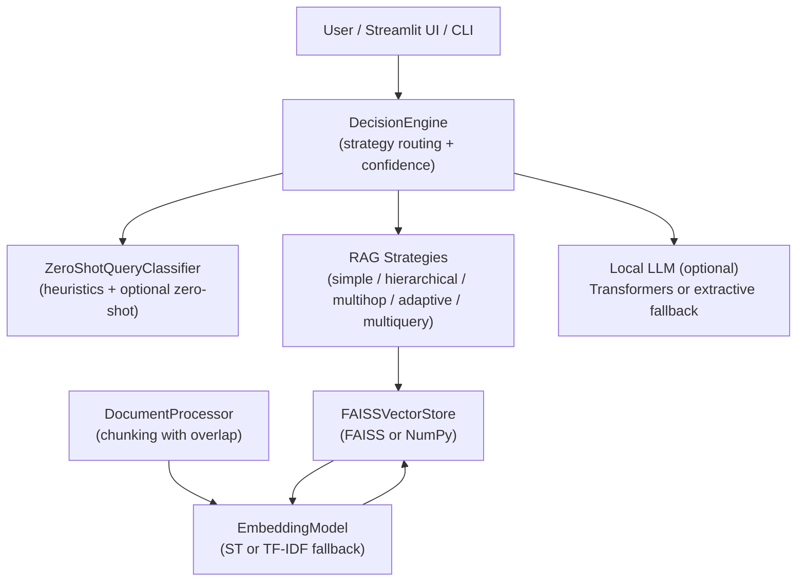
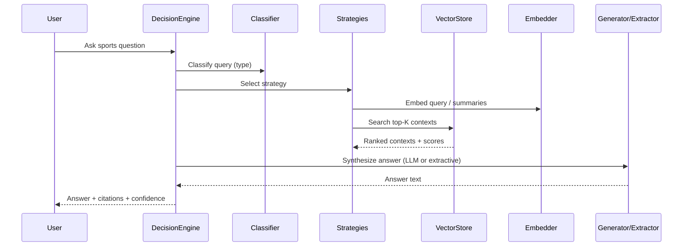

# 🚀 Sports Intelligence Chatbot (RAG)

<p align="center">


</p>

Offline-capable sports Q&A agent with autonomous query routing and multiple Retrieval-Augmented Generation (RAG) strategies. Ships with graceful fallbacks when large models or FAISS are unavailable. Load any sport content (defaults include Football/Soccer and Cricket examples).

## 📚 Table of Contents

- [Why this project?](#-why-this-project-the-problem--the-solution)
- [Features](#-features)
- [Frontend (Streamlit) Features](#-frontend-streamlit-features)
- [How it Works](#-how-it-works)
- [Quick Start](#-quick-start)
- [Configuration & Options](#-configuration--options)
- [Project Structure](#-project-structure)
- [Architecture](#-architecture)
- [Local Testing Guide](#-local-testing-guide)
- [Use Cases](#-use-cases)
- [Performance & Scalability](#-performance--scalability)
- [Contributing](#-contributing)
- [License](#-license)
- [Support](#-support)

## 🏆 Why this project? (The Problem & The Solution)

Sports knowledge is scattered across PDFs, articles, and handbooks. Finding concise, source-cited answers is hard.

- Manual search across documents is time-consuming
- Context often lacks focus and citations
- LLM-only answers can hallucinate without retrieval

This project bridges the gap with retrieval-first design, multiple query-aware strategies, and transparent citations, while running fully offline after the first model download.

## 💡 Features

- 🤖 **Multi-Strategy RAG**: simple, hierarchical, multihop, adaptive-threshold, multiquery (with safe fallbacks)
- 🧭 **Autonomous Query Routing**: classify questions as factual, comparative, analytical, creative, or non-sport
- 🧩 **Embeddings**: Sentence-Transformers by default; TF‑IDF fallback when transformers are unavailable
- 🔎 **Vector Search**: FAISS for fast similarity; NumPy fallback when FAISS is unavailable
- 🧾 **Citations**: Each answer includes source snippets and file#chunk references
- 📈 **Confidence Estimation**: Lightweight heuristic based on retrieved context breadth
- 🧱 **Graceful Degradation**: Works without GPUs, without FAISS, and even without a local LLM
- 🖥️ **Frontend**: Streamlit app for uploading docs, rebuilding index, chatting, and viewing metadata
- 🧪 **CLI Demo**: Lightweight terminal interface with confidence, strategy, and citations

## 🖥️ Frontend (Streamlit) Features

- **Knowledge Base directory** input with default to `sports_intelligence_chatbot/data/sports_knowledge_base`
- **File uploader** for PDF/TXT/MD; files are saved to the chosen KB directory
- **Rebuild index** button to re-process documents and refresh embeddings
- **Strategy override** dropdown: auto, factual, comparative, analytical, creative (when set, forces that route)
- **Chat UI with history**: messages persist during the session
- **Response metadata**: displays strategy and confidence alongside the answer

## ⚙️ How it Works

1. Load documents (PDF/TXT/MD), split into overlapping chunks for recall
2. Compute embeddings for chunks; build a FAISS (or NumPy) index
3. Classify the user question to select an appropriate RAG strategy
4. Retrieve top‑K chunks and synthesize an answer
   - If a small local LLM is available, generate; otherwise use extractive sentence selection
5. Return answer with citations, confidence, and strategy

### RAG Strategy Overview

- **simple_rag**: Single retrieval pass with score filtering
- **hierarchical_rag**: Retrieve, summarize, then re-rank summaries against the query
- **multihop_rag**: Iteratively expand the query with context to bridge multi-hop questions
- **adaptive_threshold_rag**: Dynamically lower the score threshold until enough context is found
- **multiquery_rag**: Generate/query rephrasings for robust retrieval, then merge and deduplicate

## 🏁 Quick Start

### Install

```bash
python -m venv .venv && source .venv/bin/activate
pip install -r sports_intelligence_chatbot/requirements.txt
```

Place documents under `sports_intelligence_chatbot/data/sports_knowledge_base/` (or set a custom path in the UI).

### Run CLI Demo

```bash
cd sports_intelligence_chatbot
python demo.py
```

### Run Streamlit App

```bash
cd sports_intelligence_chatbot
streamlit run streamlit_app.py
```

## 🧰 Configuration & Options

- **Embeddings**
  - Default: `sentence-transformers/all-MiniLM-L6-v2`
  - Fallback: TF‑IDF (auto-enabled if Sentence-Transformers is unavailable)
- **Vector index**
  - Default: FAISS `IndexFlatIP`
  - Fallback: NumPy matrix similarity
- **Chunking**
  - Defaults: size 800, overlap 120 (see `DocumentProcessor`)
- **Query classification**
  - Heuristics for high-precision sport detection
  - Optional zero-shot via `facebook/bart-large-mnli` when available
- **Generation**
  - Optional local LLM via `transformers` (default: `sshleifer/tiny-gpt2`)
  - Fallback: extractive sentence selection from retrieved contexts
- **Frontend override**
  - Strategy override dropdown: force `factual`, `comparative`, `analytical`, `creative`, or `auto`

## 🗂️ Project Structure

```text
SmartCoach/
├── README.md
├── sports_intelligence_chatbot/
│   ├── data/
│   │   └── sports_knowledge_base/
│   ├── demo.py
│   ├── requirements.txt
│   ├── streamlit_app.py
│   └── src/
│       ├── __init__.py
│       ├── decision_engine.py
│       ├── document_processor.py
│       ├── query_classifier.py
│       ├── rag_strategies.py
│       ├── sports_chatbot.py
│       ├── utils.py
│       └── vector_store.py
└── data/ (optional, ignored)
```

## 🧩 Architecture

### Component Diagram



### Retrieval/Answering Flow



## 🧪 Local Testing Guide

- CLI: `python sports_intelligence_chatbot/demo.py`
- UI: `streamlit run sports_intelligence_chatbot/streamlit_app.py`
- Minimal KB sanity check: add a small `.txt` to `sports_intelligence_chatbot/data/sports_knowledge_base/`, rebuild index, and ask related questions

## 🎯 Use Cases

- Coaching assistants: explain rules, tactics, drills with citations
- Q&A over sports handbooks and PDFs
- Compare teams/players with explicit source attribution

## 🚀 Performance & Scalability

- Use FAISS when available for faster search
- Sentence-Transformers embeddings are cached within the vectorizer session
- Graceful fallbacks ensure responsiveness on CPU-only machines

## 🤝 Contributing

1. Fork the repo and create a feature branch
2. Follow the existing Python code style and keep functions small and readable
3. Add or update documentation if behavior changes
4. Open a Pull Request with a clear description

## 📝 License

ISC

## 📬 Support

- Open an issue in the repository
- Check the README sections above for setup and usage
- Use the Streamlit UI to validate retrieval and strategy behavior


