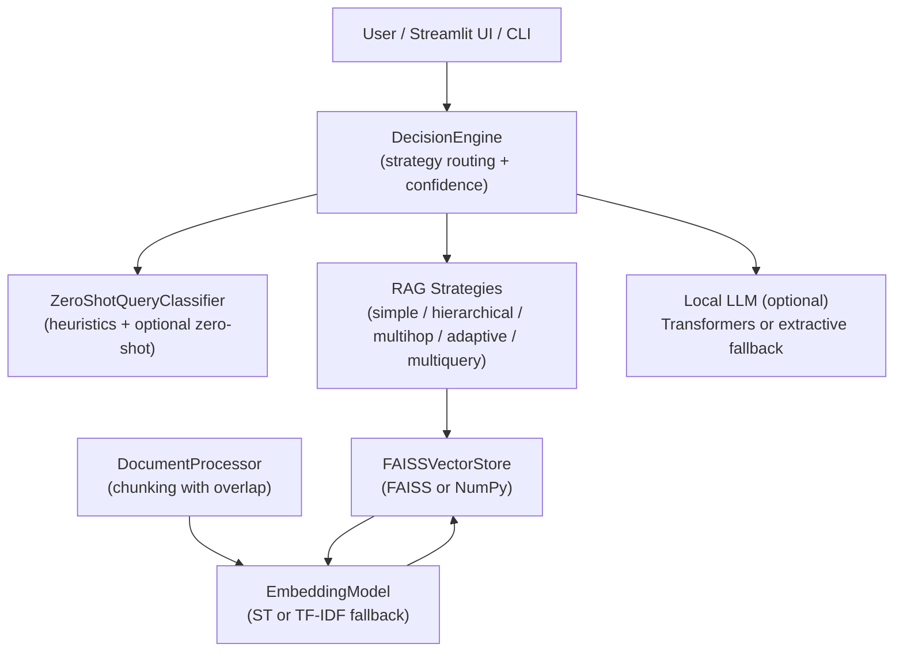
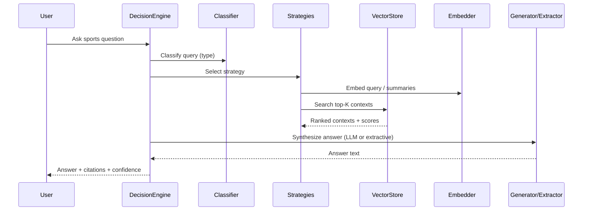

# 🚀 Sports Intelligence Chatbot (RAG)

<p align="center">


</p>

Offline-capable sports Q&A agent with autonomous query routing and multiple Retrieval-Augmented Generation (RAG) strategies. Ships with graceful fallbacks when large models or FAISS are unavailable. Load any sport content (defaults include Football/Soccer and Cricket examples).

## 📚 Table of Contents

- [Why this project?](#-why-this-project-the-problem--the-solution)
- [Features](#-features)
- [Frontend (Streamlit) Features](#-frontend-streamlit-features)
- [How it Works](#-how-it-works)
- [RAG Strategies: Detailed Design](#-rag-strategies-detailed-design)
- [Strategy Selection Policy (Scenarios → Strategy)](#-strategy-selection-policy-scenarios--strategy)
- [End-to-End Pipeline Walkthrough](#-end-to-end-pipeline-walkthrough)
- [Quick Start](#-quick-start)
- [Configuration & Options](#-configuration--options)
- [Embedding & Chunking Math](#-embedding--chunking-math)
- [Project Structure](#-project-structure)
- [Architecture](#-architecture)
- [Local Testing Guide](#-local-testing-guide)
- [Use Cases](#-use-cases)
- [Performance & Scalability](#-performance--scalability)
- [Contributing](#-contributing)
- [License](#-license)
- [Support](#-support)

## 🏆 Why this project? (The Problem & The Solution)

Sports knowledge is scattered across PDFs, articles, and handbooks. Finding concise, source-cited answers is hard.

- Manual search across documents is time-consuming
- Context often lacks focus and citations
- LLM-only answers can hallucinate without retrieval

This project bridges the gap with retrieval-first design, multiple query-aware strategies, and transparent citations, while running fully offline after the first model download.

## 💡 Features

- 🤖 **Multi-Strategy RAG**: simple, hierarchical, multihop, adaptive-threshold, multiquery (with safe fallbacks)
- 🧭 **Autonomous Query Routing**: classify questions as factual, comparative, analytical, creative, or non-sport
- 🧩 **Embeddings**: Sentence-Transformers by default; TF‑IDF fallback when transformers are unavailable
- 🔎 **Vector Search**: FAISS for fast similarity; NumPy fallback when FAISS is unavailable
- 🧾 **Citations**: Each answer includes source snippets and file#chunk references
- 📈 **Confidence Estimation**: Lightweight heuristic based on retrieved context breadth
- 🧱 **Graceful Degradation**: Works without GPUs, without FAISS, and even without a local LLM
- 🖥️ **Frontend**: Streamlit app for uploading docs, rebuilding index, chatting, and viewing metadata
- 🧪 **CLI Demo**: Lightweight terminal interface with confidence, strategy, and citations

## 🖥️ Frontend (Streamlit) Features

- **Knowledge Base directory** input with default to `sports_intelligence_chatbot/data/sports_knowledge_base`
- **File uploader** for PDF/TXT/MD; files are saved to the chosen KB directory
- **Rebuild index** button to re-process documents and refresh embeddings
- **Strategy override** dropdown: auto, factual, comparative, analytical, creative (when set, forces that route)
- **Chat UI with history**: messages persist during the session
- **Response metadata**: displays strategy and confidence alongside the answer

## ⚙️ How it Works

1. Load documents (PDF/TXT/MD), split into overlapping chunks for recall
2. Compute embeddings for chunks; build a FAISS (or NumPy) index
3. Classify the user question to select an appropriate RAG strategy
4. Retrieve top‑K chunks and synthesize an answer
   - If a small local LLM is available, generate; otherwise use extractive sentence selection
5. Return answer with citations, confidence, and strategy

### RAG Strategy Overview

- **simple_rag**: Single retrieval pass with score filtering
- **hierarchical_rag**: Retrieve, summarize, then re-rank summaries against the query
- **multihop_rag**: Iteratively expand the query with context to bridge multi-hop questions
- **adaptive_threshold_rag**: Dynamically lower the score threshold until enough context is found
- **multiquery_rag**: Generate/query rephrasings for robust retrieval, then merge and deduplicate

## 🔬 RAG Strategies: Detailed Design

The system implements several complementary retrieval strategies. Each is designed for a specific shape of user question and data distribution, and they share a common interface: produce a ranked set of context chunks plus structured citations.

- **Simple RAG**
  - Goal: Fast, precise retrieval for straightforward factual questions
  - Inputs: query text, embedding model, vector index
  - Technique: Embed the query, search top‑K by inner-product/cosine similarity, filter by a minimum score threshold
  - Why it works: With normalized vectors, inner product approximates cosine; thresholding removes off-topic matches
  - Trade‑offs: May miss paraphrases or nuanced phrasing; best when terminology is consistent with the KB

- **Hierarchical RAG**
  - Goal: Improve focus when initial retrieval returns long or noisy passages
  - Inputs: initial top‑K contexts from Simple RAG
  - Technique: Create short per‑chunk summaries (first N characters), embed summaries and the query, re‑rank by similarity, keep the best few
  - Why it works: Summaries compress salient information, reducing lexical noise before re‑ranking
  - Trade‑offs: Summaries can omit details; still bounded by initial retrieval quality

- **Multihop RAG**
  - Goal: Answer questions that require chaining facts across multiple chunks
  - Inputs: query text, number of hops
  - Technique: Retrieve once, then expand the query with the most relevant snippet from the previous hop; repeat retrieval
  - Why it works: Progressive query expansion incorporates discovered entities/terms, bridging documents
  - Trade‑offs: Risk of drift if the first hop is off‑topic; capped hops to control latency

- **Adaptive‑Threshold RAG**
  - Goal: Balance precision and recall without manual tuning
  - Inputs: base K, descending list of thresholds
  - Technique: Attempt retrieval at a high score threshold; if too few contexts are found, lower the threshold and try again
  - Why it works: Tight thresholds avoid noise; fallback thresholds ensure the system still returns something when the KB is sparse
  - Trade‑offs: Additional searches may increase latency in hard queries

- **Multiquery RAG**
  - Goal: Improve recall against varied phrasings and terminology
  - Inputs: original query and several rephrasings (generated or heuristic)
  - Technique: Run Simple RAG per variant, pool all hits, deduplicate by document index keeping the maximum score, and select the global top
  - Why it works: Different phrasings activate different parts of the embedding space; pooling captures more relevant chunks
  - Trade‑offs: More compute per query; diversity depends on variant quality. When an LLM rephraser is unavailable, the system gracefully falls back to the original query only

- **HyDE compatibility wrapper**
  - Context: HyDE (hypothetical document embeddings) often needs strong LLMs; this system provides a no‑op wrapper that defaults to Simple RAG to conserve resources

## 🧭 Strategy Selection Policy (Scenarios → Strategy)

Selection happens centrally in `sports_intelligence_chatbot/src/decision_engine.py` via `DecisionEngine.route(...)`, which first classifies the query using `sports_intelligence_chatbot/src/query_classifier.py` and then chooses a RAG strategy from `sports_intelligence_chatbot/src/rag_strategies.py`.

- **Non‑sport query** → reject with guidance
  - Scenario: Query lacks clear sports terms or intent
  - Action: Return a friendly message asking to rephrase within sports context

- **Factual intent** → adaptive‑threshold RAG
  - Scenario: “what/when/who/how” style definitions, rules, dates, entities
  - Rationale: Start precise, relax thresholds only if necessary to gather enough signal

- **Comparative intent** → multiquery RAG → fallback to hierarchical if contexts < 2
  - Scenario: “A vs B”, “compare”, “head‑to‑head”, “better than”
  - Rationale: Rephrasings broaden recall; hierarchical fallback refocuses when results are sparse

- **Analytical intent** → multihop RAG (2 hops)
  - Scenario: “why/strategy/tactical/analysis/reason” questions that need chaining
  - Rationale: Iterative query expansion bridges dispersed facts across chunks

- **Creative intent** → multiquery RAG
  - Scenario: Open‑ended suggestions, recommendations, synthesis
  - Rationale: Diverse rephrasings improve coverage for brainstorming‑style prompts

- **Availability fallbacks do not change selection**
  - Embeddings: Sentence‑Transformers → TF‑IDF
  - Index: FAISS → NumPy similarity
  - Rephraser: multiquery uses fewer/no variants if transformers are unavailable
  - Generation: local LLM → extractive sentence selection

- **Confidence estimation**
  - Implemented in `DecisionEngine._estimate_confidence(...)` as a function of how many contexts were retrieved (none → low, few → medium, several → higher)

## 🧵 End-to-End Pipeline Walkthrough

This section explains the complete flow from a user question to an answer, mapping directly to the modules and techniques in the repository.

- **Document ingestion and chunking**
  - PDFs are parsed page‑by‑page; TXT/MD are read as plain text
  - Text is split into overlapping chunks using a sentence/paragraph‑aware splitter with configurable `chunk_size` and `overlap`
  - Overlap preserves cross‑boundary context so answers don’t miss information that straddles chunk edges

- **Embeddings**
  - Primary: Sentence‑Transformers encodes each chunk; embeddings are L2‑normalized at inference for cosine‑like inner products
  - Fallback: TF‑IDF vectorizer fits on the corpus for chunk embeddings; queries are transformed and L2‑normalized for compatibility with inner‑product search
  - Rationale: Both paths produce unit‑norm vectors so inner product corresponds to cosine similarity across FAISS and NumPy paths

- **Vector index**
  - FAISS path: Flat inner‑product index for speed and simplicity; suitable for normalized vectors
  - NumPy path: Matrix multiplication for similarity when FAISS isn’t available, returning sorted indices and scores

- **Query classification and routing**
  - Heuristics detect sport domain terms and cues for factual/comparative/analytical/creative intents with high precision
  - Optional zero‑shot classifier is used when available; otherwise, heuristics decide
  - Routing policy maps: factual → adaptive threshold; comparative → multiquery (fallback to hierarchical if few contexts); analytical → multihop; creative → multiquery; non‑sport → friendly rejection

- **Retrieval strategies in action**
  - The selected strategy uses the shared embed‑search‑rank primitives to produce contexts and structured citations
  - Citations include the file path, chunk index, and similarity score for transparency

- **Answer synthesis**
  - If a small local LLM is available: a concise instruction prompt is built with the top snippets; the model generates a short answer
  - If no LLM or long contexts: extractive synthesis ranks candidate sentences from the top contexts by similarity to the query and returns the best snippet, trimmed to a safe length
  - Safety: The prompt instructs to use only provided context and admit uncertainty; extractive mode inherently avoids hallucination by quoting context

- **Confidence and metadata**
  - Confidence is estimated from the breadth of retrieved context (none → very low; few → moderate; several → higher)
  - The response includes the applied strategy, confidence score, and top citations for user inspection

- **Graceful degradation**
  - Missing FAISS → NumPy similarity
  - Missing Sentence‑Transformers → TF‑IDF vectors
  - Missing Transformers LLM → extractive synthesis
  - Missing zero‑shot classifier → heuristic classification

- **Why these design choices**
  - Normalize across components so inner‑product works uniformly
  - Prefer simple, inspectable building blocks that are robust on CPU‑only machines
  - Make fallbacks explicit and layered so the system is useful even with minimal dependencies

## 🏁 Quick Start

### Install

```bash
python -m venv .venv && source .venv/bin/activate
pip install -r sports_intelligence_chatbot/requirements.txt
```

Place documents under `sports_intelligence_chatbot/data/sports_knowledge_base/` (or set a custom path in the UI).

### Run CLI Demo

```bash
cd sports_intelligence_chatbot
python demo.py
```

### Run Streamlit App

```bash
cd sports_intelligence_chatbot
streamlit run streamlit_app.py
```

## 🧰 Configuration & Options

- **Embeddings**
  - Default: `sentence-transformers/all-MiniLM-L6-v2`
  - Fallback: TF‑IDF (auto-enabled if Sentence-Transformers is unavailable)
- **Vector index**
  - Default: FAISS `IndexFlatIP`
  - Fallback: NumPy matrix similarity
- **Chunking**
  - Defaults: size 800, overlap 120 (see `DocumentProcessor`)
- **Query classification**
  - Heuristics for high-precision sport detection
  - Optional zero-shot via `facebook/bart-large-mnli` when available
- **Generation**
  - Optional local LLM via `transformers` (default: `sshleifer/tiny-gpt2`)
  - Fallback: extractive sentence selection from retrieved contexts
- **Frontend override**
  - Strategy override dropdown: force `factual`, `comparative`, `analytical`, `creative`, or `auto`

## 📐 Embedding & Chunking Math

- Embedding dimension does not depend on document length.
  - Sentence‑Transformers path: \(D = 384\) for chunks and queries (from `all-MiniLM-L6-v2`).
  - TF‑IDF fallback: \(D = \min(|V_{corpus}|,\ 4096)\), same for chunks and queries.
- Number of embeddings equals the number of chunks.

Variables: \(L\) = document length (characters), \(S = 800\) (chunk size), \(O = 120\) (overlap), \(\text{step} = S - O = 680\).

- Chunk count \(n(L)\):
  - If \(L \le S\): \(n = 1\)
  - If \(L > S\): \(n = 1 + \lceil (L - S) / \text{step} \rceil\)
- Embedding shapes:
  - Chunks matrix: \((n, D)\)
  - Query: \((D)\) or \((1, D)\)
- Memory (float32): \(\text{bytes} \approx n \times D \times 4\)

Examples (approx.):
- \(L = 10{,}000\): \(n = 1 + \lceil (10{,}000 - 800)/680 \rceil = 15\)
  - ST: \(~15 \times 384 \times 4 \approx 23\,\text{KB}\)
  - TF‑IDF (\(D=4096\)): \(~15 \times 4096 \times 4 \approx 240\,\text{KB}\)
- \(L = 100{,}000\): \(n = 148\)
  - ST: \(~148 \times 384 \times 4 \approx 226\,\text{KB}\)
  - TF‑IDF: \(~148 \times 4096 \times 4 \approx 2.32\,\text{MB}\)
- \(L = 1{,}000{,}000\): \(n = 1472\)
  - ST: \(~1{,}472 \times 384 \times 4 \approx 2.16\,\text{MB}\)
  - TF‑IDF: \(~1{,}472 \times 4096 \times 4 \approx 24.1\,\text{MB}\)

Note: The splitter respects sentence/paragraph boundaries, so chunk edges may shift slightly; the formula above matches the character-based accumulation used.

## 🗂️ Project Structure

```text
SmartCoach/
├── README.md
├── sports_intelligence_chatbot/
│   ├── data/
│   │   └── sports_knowledge_base/
│   ├── demo.py
│   ├── requirements.txt
│   ├── streamlit_app.py
│   └── src/
│       ├── __init__.py
│       ├── decision_engine.py
│       ├── document_processor.py
│       ├── query_classifier.py
│       ├── rag_strategies.py
│       ├── sports_chatbot.py
│       ├── utils.py
│       └── vector_store.py
└── data/ (optional, ignored)
```

## 🧩 Architecture

### Component Diagram



### Retrieval/Answering Flow



## 🧪 Local Testing Guide

- CLI: `python sports_intelligence_chatbot/demo.py`
- UI: `streamlit run sports_intelligence_chatbot/streamlit_app.py`
- Minimal KB sanity check: add a small `.txt` to `sports_intelligence_chatbot/data/sports_knowledge_base/`, rebuild index, and ask related questions

## 🎯 Use Cases

- Coaching assistants: explain rules, tactics, drills with citations
- Q&A over sports handbooks and PDFs
- Compare teams/players with explicit source attribution

## 🚀 Performance & Scalability

- Use FAISS when available for faster search
- Sentence-Transformers embeddings are cached within the vectorizer session
- Graceful fallbacks ensure responsiveness on CPU-only machines

## 🤝 Contributing

1. Fork the repo and create a feature branch
2. Follow the existing Python code style and keep functions small and readable
3. Add or update documentation if behavior changes
4. Open a Pull Request with a clear description

## 📝 License

ISC

## 📬 Support

- Open an issue in the repository
- Check the README sections above for setup and usage
- Use the Streamlit UI to validate retrieval and strategy behavior


